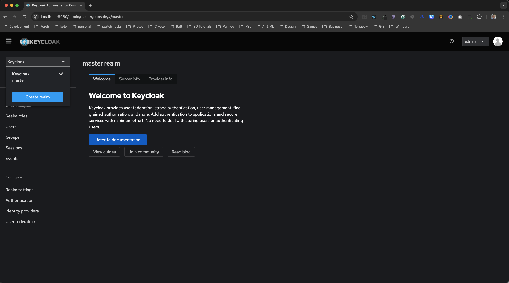
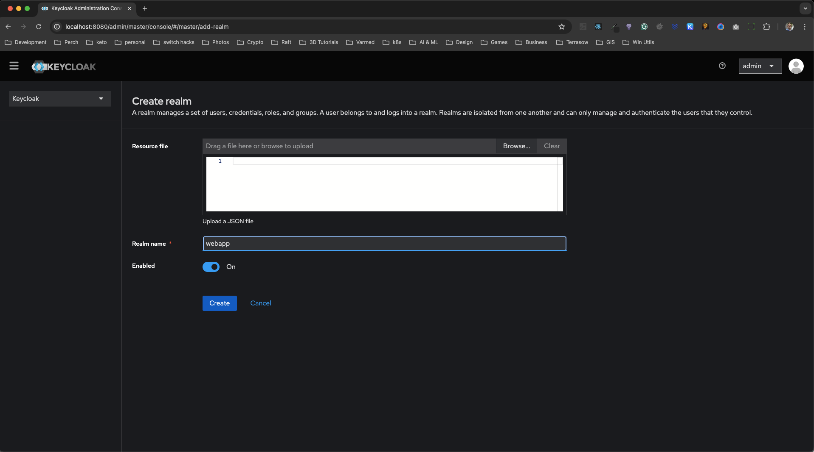
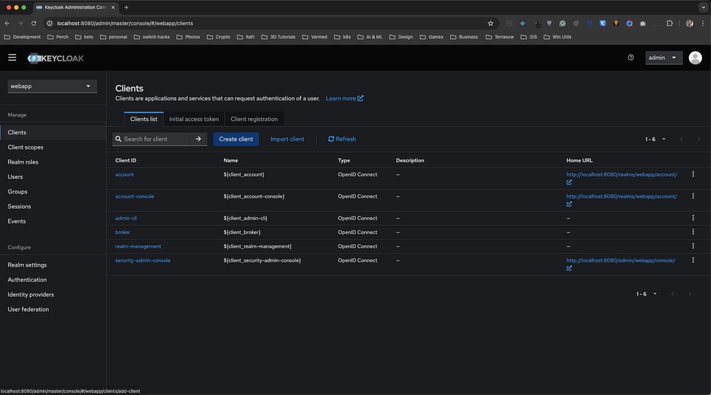
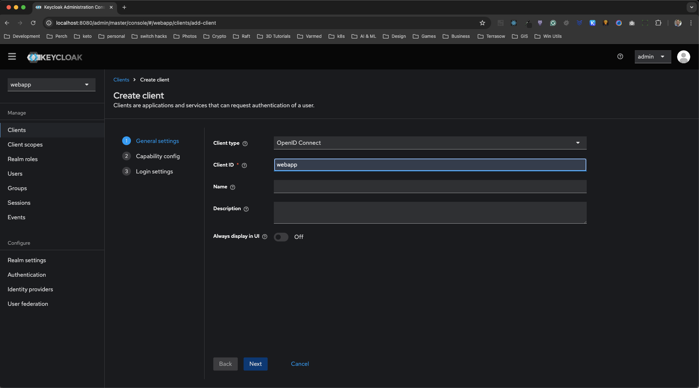
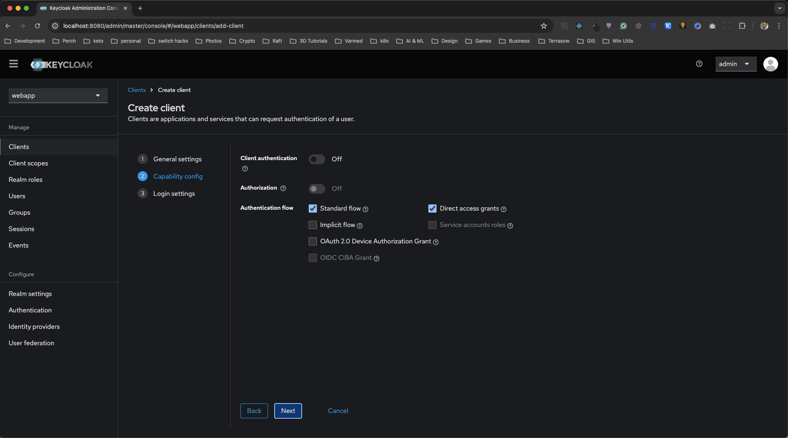
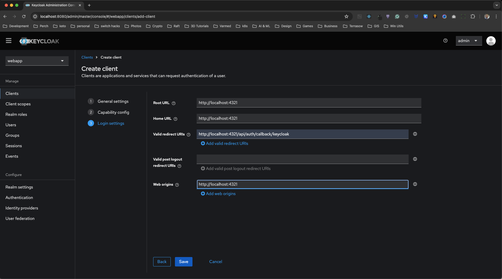
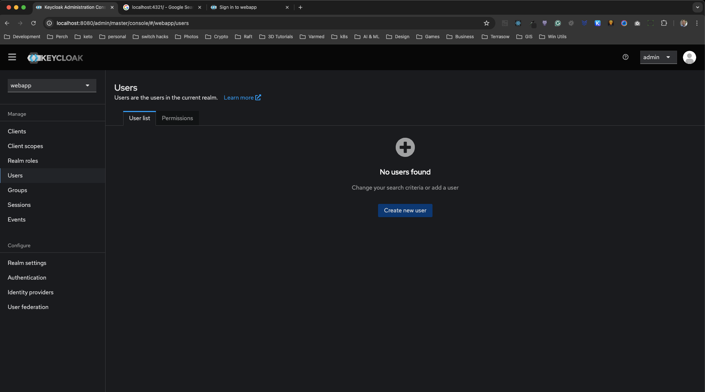
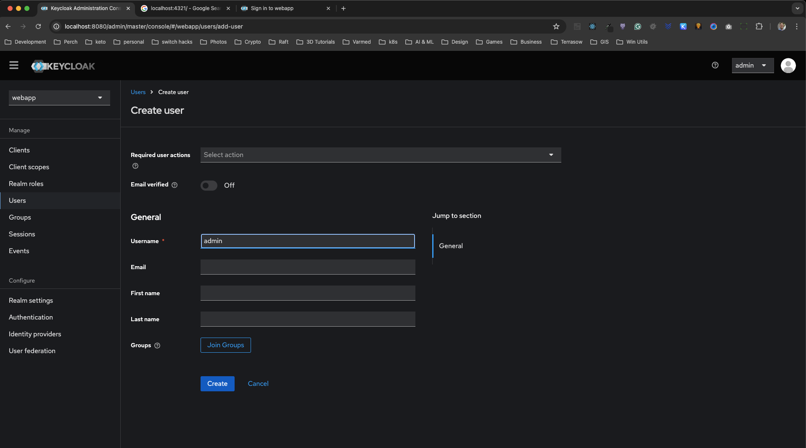
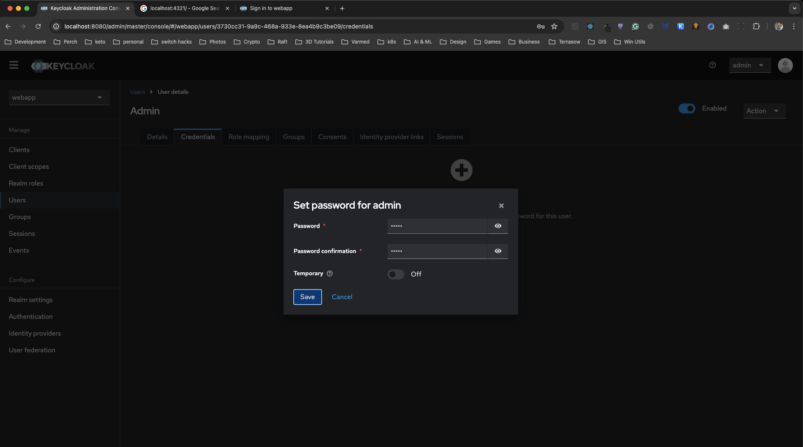
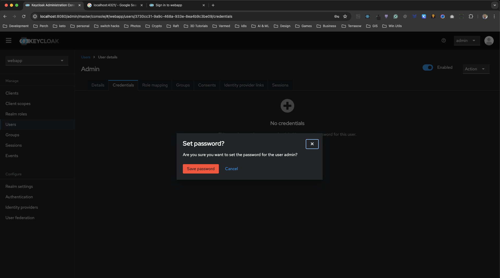

# Astro, Keycloak and Docker Compose Example

This is a simple setup of Astro, Keycloak and Docker Compose for local development.

## Prerequisites

- Docker
- Docker Compose
- Node.js
- Astro

## How to run the project

Clone this repo and run `docker-compose up`. This will start up keycloak, postgres and astro.

## URL to access apps

- keycloak: http://localhost:8080
- astro: http://localhost:4321

## Create a keycloak realm

Once keycloak is running visit `http://localhost:8080` in your browser and login using the admin credentials:

```bash
- Username: admin
- Password: admin
```

Once you log in to keycloak, click on the `Create realm` button.



On the next screen enter `webapp` as the name for the realm.



Once the realm is created now click on `Clients` on the sidebar and click on `Create client` button.



Enter `webapp` as the `Client ID`



On the next screen ensure the `Client authentication` toggle switch is off and both ``Standard flow and `Direct access grants` are checked.



On the next screen enter `http://localhost:4321` as the Root URL, Home URL and Web Origins. In the `Valid redirect URIs` enter: `http://localhost:4321/api/auth/callback/keycloak`



## Create a user

Now we need to create a user in order to login to the webapp client. To do this click on `Users` in the side bard and click on the `Create new user` button.



Enter user name you want to use, in this case we used `admin` and click the `create` button.



Once the user is created we need to create a password. Click on the `Credentials` tab and click on the `Set password` button. In the `Password` and `Password confirmation` fields enter the password you want to use and ensure the `Temporary` toggle switch is off and click `Save`





You should now be able to login to the astro app using the username and password you just created in keycloak.

Here is a quick video of the whole process.
